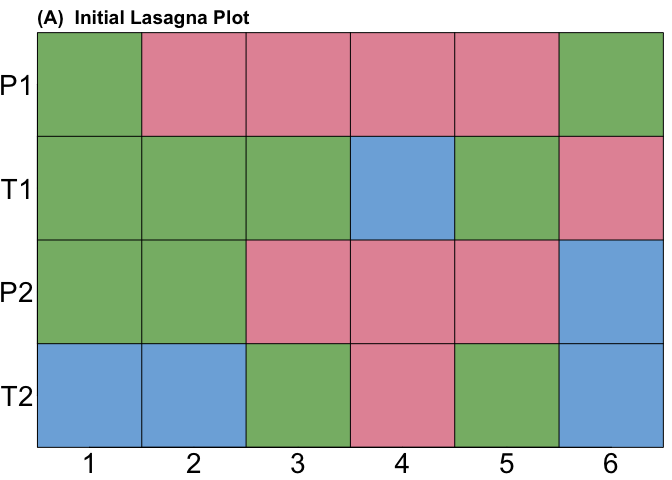
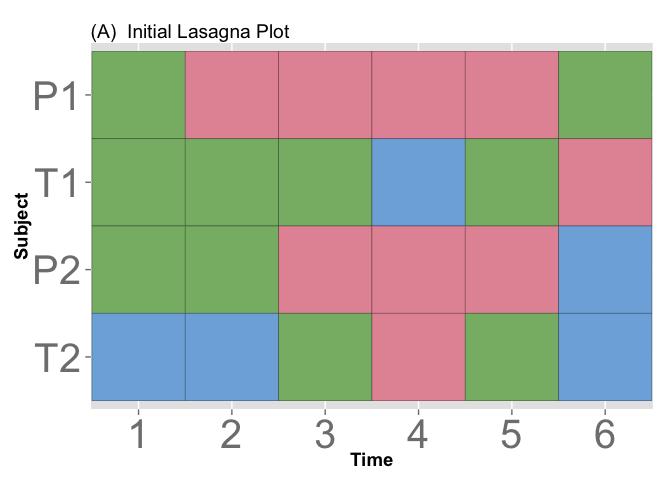
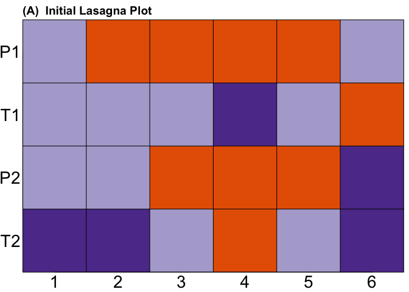
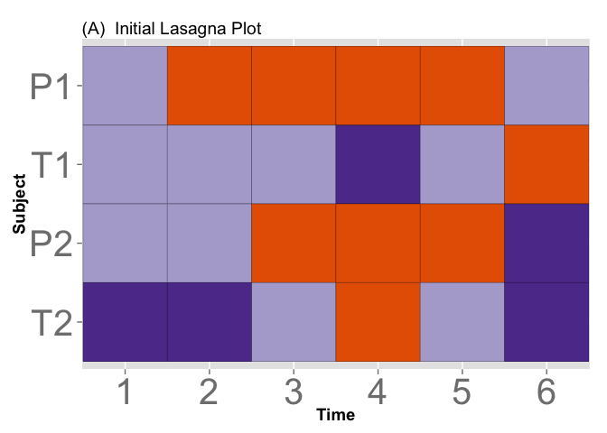
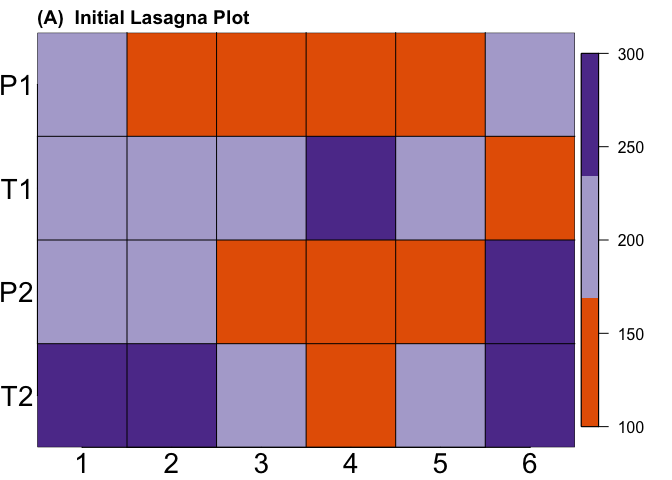
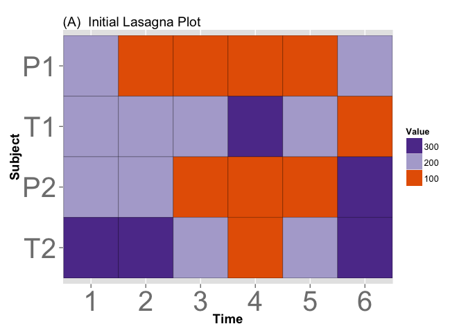
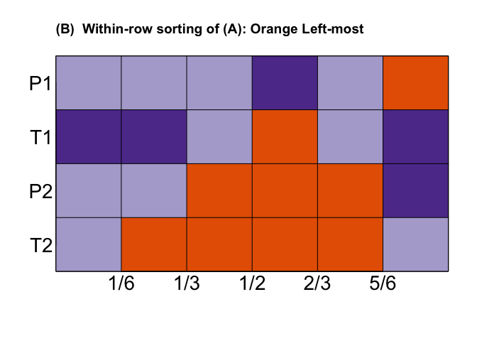
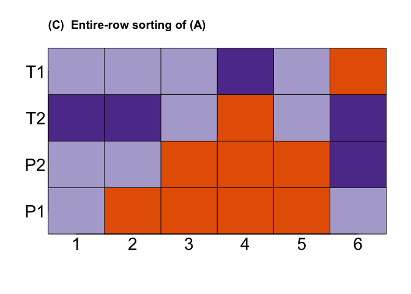

# lasagnar:  Lasagna plots R package
Bruce Swihart  
November 5, 2014  

[1] The original paper:  [Lasagna Plots: A Saucy Alternative to Spaghetti Plots](http://journals.lww.com/epidem/Fulltext/2010/09000/Lasagna_Plots__A_Saucy_Alternative_to_Spaghetti.15.aspx)

[2]  The follow-up paper for SAS code: [Lasagna Plots Made in Different (Statistical) Ovens](http://journals.lww.com/epidem/Fulltext/2012/11000/Lasagna_Plots_Made_in_Different__Statistical_.33.aspx)


There is [an appendix](http://www.ncbi.nlm.nih.gov/pmc/articles/PMC2937254/bin/NIHMS225391-supplement-1.pdf) for [1] that has some `R` code, but no one likes it.  At the time the only option for supplemental materials was to put R code into a PDF, thus introducing a hurdle for easy usage.  This repo on github has been long overdue.  This repo is an R-package, and can be installed and ready to go with a few lines in R.

#Quick start!:


```r
library(devtools)                                                                                                                                
install_github("swihart/lasagnar")                                                               
library(lasagnar)   
library(ggplot2)
library(reshape2)
library(RColorBrewer)
library(colorspace)  
## get me a matrix with rownames:
mat <- matrix(1:100, nrow=10, ncol=10, byrow=TRUE)[sample(1:10),]
rownames(mat) <- letters[1:nrow(mat)]

lasagna(mat)
```

 

Note:  Windows machines will need to install [Rtools](http://cran.r-project.org/bin/windows/Rtools/).  All machines will need to have run `install.packages("devtools")` at the R prompt once.

#Base and ggplot2 implementation:

```r
## the matrix containing data for Figure 02a
H.mat <- matrix(NA, nrow=4, ncol=6)
H.mat[1, 1:6] = 100*c(2, 1, 1, 1, 1, 2)
H.mat[2, 1:6] = 100*c(2, 2, 2, 3, 2, 1)
H.mat[3, 1:6] = 100*c(2, 2, 1, 1, 1, 3)
H.mat[4, 1:6] = 100*c(3, 3, 2, 1, 2, 3)
## set rownames with ids
rownames(H.mat)<-c("P1","T1","P2","T2")
## set colnames with time / location / column index:
colnames(H.mat)<-seq(ncol(H.mat))
## name your dimensions
names(dimnames(H.mat))<-c('Subject','Time')
## print out to see it!
H.mat
```

```
##        Time
## Subject   1   2   3   4   5   6
##      P1 200 100 100 100 100 200
##      T1 200 200 200 300 200 100
##      P2 200 200 100 100 100 300
##      T2 300 300 200 100 200 300
```

```r
## Fiddle with the margins:
par(mai = c(.34,.39,.34,.09))

## base:
lasagna(H.mat)
```

 

```r
## ggplot:
gglasagna(H.mat)
```

 

```r
## Choose a palette
palette <- brewer.pal(4, "PuOr")[-2]

lasagna(H.mat, col=palette)
```

 

```r
gglasagna(H.mat, col=palette)
```

 

```r
## however, you may want lasagna_plain() and customize the plot how you wish
## with axes statements, etc:

## variables to specify the scalar CEX multiplier for title, labels, and axis:
fig02.main <- 1.75
fig02.lab <- 1.75
fig02.axis <- 1.75

## 
## Base:
##
## initial lasagna_plain() call followed by may title() and axis() calls:
lasagna_plain(H.mat,
        col=palette,
        axes=F,
        xlab = "",
        ylab = "", cex.lab=fig02.lab, tck=0, mgp=c(0,0,0))
box()
title("(A)  Initial Lasagna Plot", adj=0)
axis(1, seq(0,1,1/5), 1:6, cex.axis=fig02.axis, tck=0, mgp=c(0,.50,0))
axis(2, seq(0,1,1/3), rev(c("P1","T1","P2","T2")),las=1,
     cex.axis=fig02.axis, tck=0, mgp=c(0,.2,0))
## next two axis() calls add grid-lines:
axis(1,
     c(1/10,3/10,5/10,7/10,9/10),
     lab=NA,
     tck=1,
     lty=1,
     col="black") 
axis(2,
     c(1/6,3/6,5/6),
     lab=NA,
     tck=1,
     lty=1,
     col="black") 
```

 

```r
##
## ggplot2:
##
##library(ggplot2)
##library(reshape2)
H.df<-melt(H.mat)

## EDIT to nograpes answer:
## reorder the factor that is Subject by setting levels to the reverse order of rownames 
H.df$Subject <- factor(H.df$Subject, levels = rev(rownames(H.mat))) 


# If you want those exact colours the author used:
col<-palette[match(ordered(H.df$value),levels(ordered(H.df$value)))]
ggplot(H.df,aes(x=Time,y=Subject,fill=col)) + 
  geom_tile(colour='black') + scale_fill_identity() +
  ## add title: 
  ggtitle("(A)  Initial Lasagna Plot")+
  ## adjust size:
  theme(axis.text=element_text(size=30),
        axis.title=element_text(size=14,face="bold"))+
  ## get all the breaks:
  scale_x_discrete(breaks=1:6) +
  ## and for some reason need this line to zoom:
  coord_cartesian(xlim=c(.49,6.51))
```

 


#Four sorting functions:  `wr()`, `er()`, `wc()`, `ec()`.
* `wr()` sorts within-row: if the values being displayed are discrete, use `wr.disc()`; continuous use `wr.cont()`.
`lasagna_plain(wr.disc(H.mat))` generates a within-row sorted `H.mat` where the smallest value (and corresponding color) is left-most; to control this use the `colorSeq` option: `lasagna_plain(wr.disc(H.mat), colorSeq=c(300,100,200))` (see code chunk below for full code; axes, etc.):
 

 


```r
## within-row
lasagna_plain(wr.disc(H.mat),
        col=palette,
        axes=F,
        xlab = "",
        ylab = "", cex.lab=fig02.lab, tck=0, mgp=c(0,.50,0))
box()
title("(B)  Within-row sorting of (A): Orange Left-most", adj=0)
## axis(1, seq(0,1,1/5), 1:6, cex.axis=fig02.axis, tck=0, mgp=c(0,.1,0))
axis(1, c(1/10,3/10,5/10,7/10,9/10),c("1/6","1/3","1/2","2/3","5/6") , cex.axis=fig02.axis, tck=0, mgp=c(0,.50,0))
axis(2,
     seq(0,1,1/3),
     rev(c("P1",
           "T1",
           "P2",
           "T2")),
     las=1,
     cex.axis=fig02.axis, tck=0, mgp=c(0,.2,0))
axis(1,
     c(1/10,3/10,5/10,7/10,9/10),
     lab=NA,
     tck=1,
     lty=1,
     col="black") # grid lines
axis(2,
     c(1/6,3/6,5/6),
     lab=NA,
     tck=1,
     lty=1,
     col="black") # grid lines
```


```r
## within-row with colorSeq order control:
lasagna_plain(wr.disc(H.mat, colorSeq=c(300,100,200)),
        col=palette,
        axes=F,
        xlab = "",
        ylab = "", cex.lab=fig02.lab, tck=0, mgp=c(0,.50,0))
box()
title("(B)  Within-row sorting of (A): Dark Purple Left-most", adj=0)
## axis(1, seq(0,1,1/5), 1:6, cex.axis=fig02.axis, tck=0, mgp=c(0,.1,0))
axis(1, c(1/10,3/10,5/10,7/10,9/10),c("1/6","1/3","1/2","2/3","5/6") , cex.axis=fig02.axis, tck=0, mgp=c(0,.50,0))
axis(2,
     seq(0,1,1/3),
     rev(c("P1",
           "T1",
           "P2",
           "T2")),
     las=1,
     cex.axis=fig02.axis, tck=0, mgp=c(0,.2,0))
axis(1,
     c(1/10,3/10,5/10,7/10,9/10),
     lab=NA,
     tck=1,
     lty=1,
     col="black") # grid lines
axis(2,
     c(1/6,3/6,5/6),
     lab=NA,
     tck=1,
     lty=1,
     col="black") # grid lines
```


Note:  in progress below this line.
Note:  in progress below this line.
Note:  in progress below this line.

Something came to my attention while working on er():  no one wants to handle the axes comments themselves ---- rewrite lasagna to include these and do automatic sorting (for instance, if you don't include the axes comments in lasagna, you'll have to do the sorting of the subject ids outside of the er() sorting...I mean, what a mess.  )


* `er()` sorts entire-row: if the values being displayed are discrete
`lasagna_plain(er(H.mat))` generates an entire-row sorted `H.mat` where the smallest value (and corresponding color) is left-most; to control this use the `orderVar` option: `lasagna_plain(wr.disc(H.mat), colorSeq=c(300,100,200))` (see code chunk below for full code; axes, etc.):
 

 


```r
## within-row
lasagna_plain(wr.disc(H.mat),
        col=palette,
        axes=F,
        xlab = "",
        ylab = "", cex.lab=fig02.lab, tck=0, mgp=c(0,.50,0))
box()
title("(B)  Within-row sorting of (A): Orange Left-most", adj=0)
## axis(1, seq(0,1,1/5), 1:6, cex.axis=fig02.axis, tck=0, mgp=c(0,.1,0))
axis(1, c(1/10,3/10,5/10,7/10,9/10),c("1/6","1/3","1/2","2/3","5/6") , cex.axis=fig02.axis, tck=0, mgp=c(0,.50,0))
axis(2,
     seq(0,1,1/3),
     rev(c("P1",
           "T1",
           "P2",
           "T2")),
     las=1,
     cex.axis=fig02.axis, tck=0, mgp=c(0,.2,0))
axis(1,
     c(1/10,3/10,5/10,7/10,9/10),
     lab=NA,
     tck=1,
     lty=1,
     col="black") # grid lines
axis(2,
     c(1/6,3/6,5/6),
     lab=NA,
     tck=1,
     lty=1,
     col="black") # grid lines
```


```r
## within-row with colorSeq order control:
lasagna_plain(wr.disc(H.mat, colorSeq=c(300,100,200)),
        col=palette,
        axes=F,
        xlab = "",
        ylab = "", cex.lab=fig02.lab, tck=0, mgp=c(0,.50,0))
box()
title("(B)  Within-row sorting of (A): Dark Purple Left-most", adj=0)
## axis(1, seq(0,1,1/5), 1:6, cex.axis=fig02.axis, tck=0, mgp=c(0,.1,0))
axis(1, c(1/10,3/10,5/10,7/10,9/10),c("1/6","1/3","1/2","2/3","5/6") , cex.axis=fig02.axis, tck=0, mgp=c(0,.50,0))
axis(2,
     seq(0,1,1/3),
     rev(c("P1",
           "T1",
           "P2",
           "T2")),
     las=1,
     cex.axis=fig02.axis, tck=0, mgp=c(0,.2,0))
axis(1,
     c(1/10,3/10,5/10,7/10,9/10),
     lab=NA,
     tck=1,
     lty=1,
     col="black") # grid lines
axis(2,
     c(1/6,3/6,5/6),
     lab=NA,
     tck=1,
     lty=1,
     col="black") # grid lines
```


