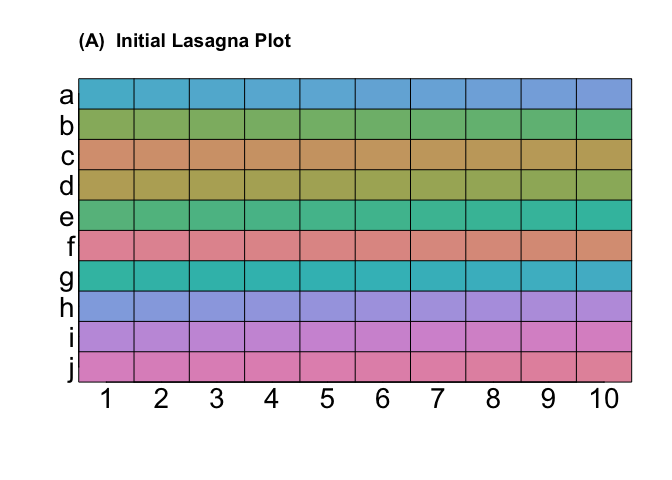
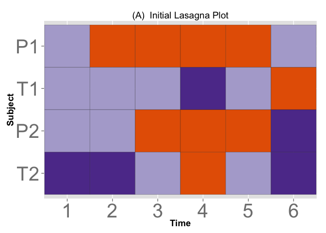
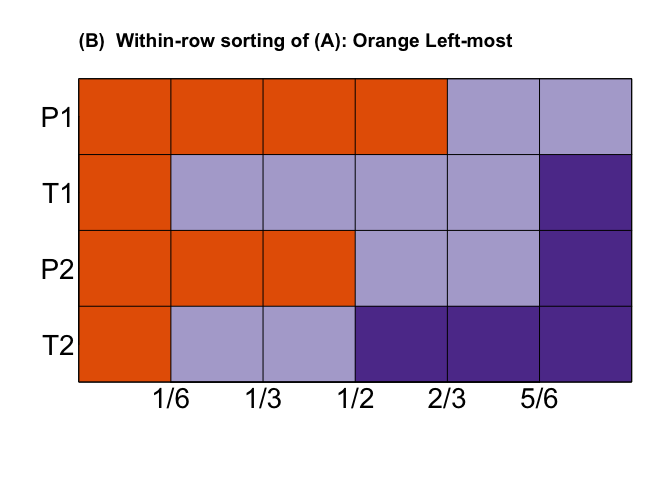
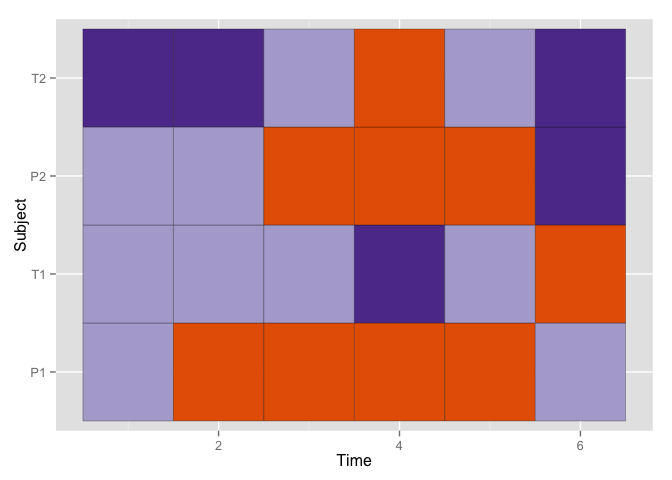

# lasagnar:  Lasagna plots R package
Bruce Swihart  
November 5, 2014  

[1] The original paper:  [Lasagna Plots: A Saucy Alternative to Spaghetti Plots](http://journals.lww.com/epidem/Fulltext/2010/09000/Lasagna_Plots__A_Saucy_Alternative_to_Spaghetti.15.aspx)

[2]  The follow-up paper for SAS code: [Lasagna Plots Made in Different (Statistical) Ovens](http://journals.lww.com/epidem/Fulltext/2012/11000/Lasagna_Plots_Made_in_Different__Statistical_.33.aspx)


There is [an appendix](http://www.ncbi.nlm.nih.gov/pmc/articles/PMC2937254/bin/NIHMS225391-supplement-1.pdf) for [1], but no one likes it.  At the time the only option for supplemental materials was to put R code into a PDF, thus introducing a hurdle for easy usage.  This repo on github has been long overdue.  This repo is an R-package, and can be installed and ready to go with a few lines in R.

#Quick start!:


```r
library(devtools)                                                                                                                                
install_github("swihart/lasagnar")                                                               
library(lasagnar)   
library(ggplot2)
library(reshape2)
library(RColorBrewer)
library(colorspace)                                                                                                                              
lasagna(matrix(1:100, nrow=10, ncol=10, byrow=TRUE)[sample(1:10),])
```

 

Note:  Windows machines will need to install [Rtools](http://cran.r-project.org/bin/windows/Rtools/).  All machines will need to have run `install.packages("devtools")` at the R prompt once.

#Base and ggplot2 implementation:

```r
## Choose a palette
palette <- brewer.pal(4, "PuOr")[-2]
## the matrix containing data for Figure 02a
H.mat <- matrix(NA, nrow=4, ncol=6)
H.mat[1, 1:6] = 100*c(2, 1, 1, 1, 1, 2)
H.mat[2, 1:6] = 100*c(2, 2, 2, 3, 2, 1)
H.mat[3, 1:6] = 100*c(2, 2, 1, 1, 1, 3)
H.mat[4, 1:6] = 100*c(3, 3, 2, 1, 2, 3)
## margins:
par(mai = c(.34,.39,.34,.09))
## variables to specify the scalar CEX multiplier for title, labels, and axis:
fig02.main <- 1.75
fig02.lab <- 1.75
fig02.axis <- 1.75


## 
## Base:
##
## initial lasagna() call followed by may title() and axis() calls:
lasagna(H.mat,
        col=palette,
        axes=F,
        xlab = "",
        ylab = "", cex.lab=fig02.lab, tck=0, mgp=c(0,0,0))
box()
title("(A)  Initial Lasagna Plot", adj=0)
axis(1, seq(0,1,1/5), 1:6, cex.axis=fig02.axis, tck=0, mgp=c(0,.50,0))
axis(2, seq(0,1,1/3), rev(c("P1","T1","P2","T2")),las=1,
     cex.axis=fig02.axis, tck=0, mgp=c(0,.2,0))
## next two axis() calls add grid-lines:
axis(1,
     c(1/10,3/10,5/10,7/10,9/10),
     lab=NA,
     tck=1,
     lty=1,
     col="black") 
axis(2,
     c(1/6,3/6,5/6),
     lab=NA,
     tck=1,
     lty=1,
     col="black") 
```

 

```r
##
## ggplot2:
##
library(ggplot2)
library(reshape2)
rownames(H.mat)<-c('P1','T1','P2','T2')
colnames(H.mat)<-seq(ncol(H.mat))
names(dimnames(H.mat))<-c('Subject','Time')
H.df<-melt(H.mat)

## EDIT to nograpes answer:
## reorder the factor that is Subject by setting levels to the reverse order of rownames 
H.df$Subject <- factor(H.df$Subject, levels = rev(rownames(H.mat))) 


# If you want those exact colours the author used:
col<-palette[match(ordered(H.df$value),levels(ordered(H.df$value)))]
ggplot(H.df,aes(x=Time,y=Subject,fill=col)) + 
  geom_tile(colour='black') + scale_fill_identity() +
  ## add title: 
  ggtitle("(A)  Initial Lasagna Plot")+
  ## adjust size:
  theme(axis.text=element_text(size=30),
        axis.title=element_text(size=14,face="bold"))+
  ## get all the breaks:
  scale_x_discrete(breaks=1:6) +
  ## and for some reason need this line to zoom:
  coord_cartesian(xlim=c(.49,6.51))
```

 


#Four sorting functions:  `wr()`, `er()`, `wc()`, `ec()`.
* `wr()`


Note:  in progress below this line.


#Base graphics require `axis()` and `title()`:
As we see in the creation of Figure 2A of the [1] paper:

```r
## Choose a palette
palette <- brewer.pal(4, "PuOr")[-2]
## the matrix containing data for Figure 02a
babye <- matrix(NA, nrow=4, ncol=6)
babye[1, 1:6] = 100*c(2, 1, 1, 1, 1, 2)
babye[2, 1:6] = 100*c(2, 2, 2, 3, 2, 1)
babye[3, 1:6] = 100*c(2, 2, 1, 1, 1, 3)
babye[4, 1:6] = 100*c(3, 3, 2, 1, 2, 3)
## margins:
par(mai = c(.34,.39,.34,.09))
## variables to specify the scalar CEX multiplier for title, labels, and axis:
fig02.main <- 1.75
fig02.lab <- 1.75
fig02.axis <- 1.75
## initial lasagna() call followed by may title() and axis() calls:
lasagna(babye,
        col=palette,
        axes=F,
        xlab = "",
        ylab = "", cex.lab=fig02.lab, tck=0, mgp=c(0,0,0))
box()
title("(A)  Initial Lasagna Plot", adj=0)
axis(1, seq(0,1,1/5), 1:6, cex.axis=fig02.axis, tck=0, mgp=c(0,.50,0))
axis(2, seq(0,1,1/3), rev(c("P1","T1","P2","T2")),las=1,
     cex.axis=fig02.axis, tck=0, mgp=c(0,.2,0))
## next two axis() calls add grid-lines:
axis(1,
     c(1/10,3/10,5/10,7/10,9/10),
     lab=NA,
     tck=1,
     lty=1,
     col="black") 
axis(2,
     c(1/6,3/6,5/6),
     lab=NA,
     tck=1,
     lty=1,
     col="black") 
```

 


#ggplot implementation does not require `axis()` and `title()`:
With many thanks to [nograpes](http://stackoverflow.com/users/1086688/nograpes) at [stackoverflow](http://stackoverflow.com/questions/17820275/lasagna-plots-in-r), we have a ggplot implementation:

```r
## Create the data
palette <- brewer.pal(4, "PuOr")[-2]
## the matrix containing data for Figure 02a
H.mat <- matrix(NA, nrow=4, ncol=6)
H.mat[1, 1:6] = 100*c(2, 1, 1, 1, 1, 2)
H.mat[2, 1:6] = 100*c(2, 2, 2, 3, 2, 1)
H.mat[3, 1:6] = 100*c(2, 2, 1, 1, 1, 3)
H.mat[4, 1:6] = 100*c(3, 3, 2, 1, 2, 3)

library(ggplot2)
library(reshape2)
rownames(H.mat)<-c('P1','T1','P2','T2')
colnames(H.mat)<-seq(ncol(H.mat))
names(dimnames(H.mat))<-c('Subject','Time')
H.df<-melt(H.mat)


# If you want those exact colours the author used:
col<-palette[match(ordered(H.df$value),levels(ordered(H.df$value)))]
ggplot(H.df,aes(x=Time,y=Subject,fill=col)) + 
  geom_tile(colour='black') + scale_fill_identity()
```

 

However, we still need to do some customization:  the row ordering in the `ggplot()` doesn't correspond with the ordering in the data.frame (e.g., P1 is bottom row in plot but first row in data.frame) and not all the numbers are showing on the x-axis.  Easy fixes:

```r
## Create the data
palette <- brewer.pal(4, "PuOr")[-2]
## the matrix containing data for Figure 02a
H.mat <- matrix(NA, nrow=4, ncol=6)
H.mat[1, 1:6] = 100*c(2, 1, 1, 1, 1, 2)
H.mat[2, 1:6] = 100*c(2, 2, 2, 3, 2, 1)
H.mat[3, 1:6] = 100*c(2, 2, 1, 1, 1, 3)
H.mat[4, 1:6] = 100*c(3, 3, 2, 1, 2, 3)

library(ggplot2)
library(reshape2)
rownames(H.mat)<-c('P1','T1','P2','T2')
colnames(H.mat)<-seq(ncol(H.mat))
names(dimnames(H.mat))<-c('Subject','Time')
H.df<-melt(H.mat)

## EDIT to nograpes answer:
## reorder the factor that is Subject by setting levels to the reverse order of rownames 
H.df$Subject <- factor(H.df$Subject, levels = rev(rownames(H.mat))) 


# If you want those exact colours the author used:
col<-palette[match(ordered(H.df$value),levels(ordered(H.df$value)))]
ggplot(H.df,aes(x=Time,y=Subject,fill=col)) + 
  geom_tile(colour='black') + scale_fill_identity() + 
##   
## EDIT to nograpes answer in the remaining lines:
  ## add title:
  ggtitle("(A)  Initial Lasagna Plot")+
  ## adjust size:
theme(axis.text=element_text(size=30),
      axis.title=element_text(size=14,face="bold"))+
## get all the breaks:
  scale_x_discrete(breaks=1:6) +
## and for some reason need this line to zoom:
  coord_cartesian(xlim=c(.49,6.51))
```

 
